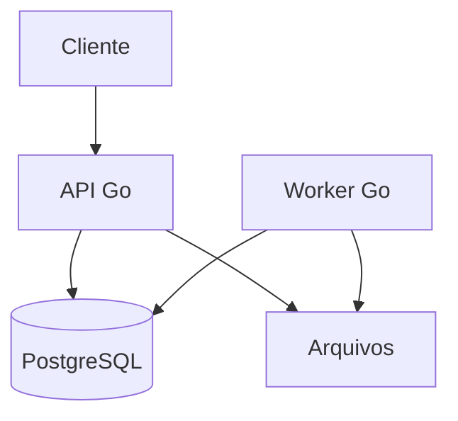

# Arquitetura

## Abordagem

Comece como **monólito modular**. O MVP não justifica microsserviços. API e worker são executáveis separados que compartilham os mesmos módulos internos.



No MVP, a tabela `jobs` funciona como fila usando `FOR UPDATE SKIP LOCKED`. Redis só entra depois de necessidade comprovada.

## Módulos

- `auth`: usuários, credenciais e tokens;
- `organization`: tenants, membros e perfis;
- `importfile`: upload, validação e parsing;
- `reconciliation`: execuções, regras e divergências;
- `audit`: eventos relevantes;
- `platform`: banco, HTTP, configuração, logs e arquivos.

## Camadas

```text
handler -> use case -> repository -> PostgreSQL
```

Regras de negócio não dependem de HTTP nem SQL. Interfaces surgem apenas quando facilitam testes ou troca de implementação.

## Processamento

1. API salva metadados e o arquivo fora do banco.
2. Após receber as duas fontes, cria um job.
3. Worker reserva o job em transação.
4. Parser lê o arquivo em streaming.
5. Normalizador cria registros canônicos.
6. Motor compara e grava divergências em lote.
7. Worker atualiza totais e status.

## Estados

`DRAFT -> FILES_RECEIVED -> QUEUED -> PROCESSING -> COMPLETED`

Erros levam a `FAILED`. Reprocessamento cria nova execução.

## Observabilidade

- logs JSON com `request_id`, `tenant_id`, `user_id` e `job_id`;
- `/health/live` sem dependências;
- `/health/ready` verifica PostgreSQL;
- métricas na fase 2.
