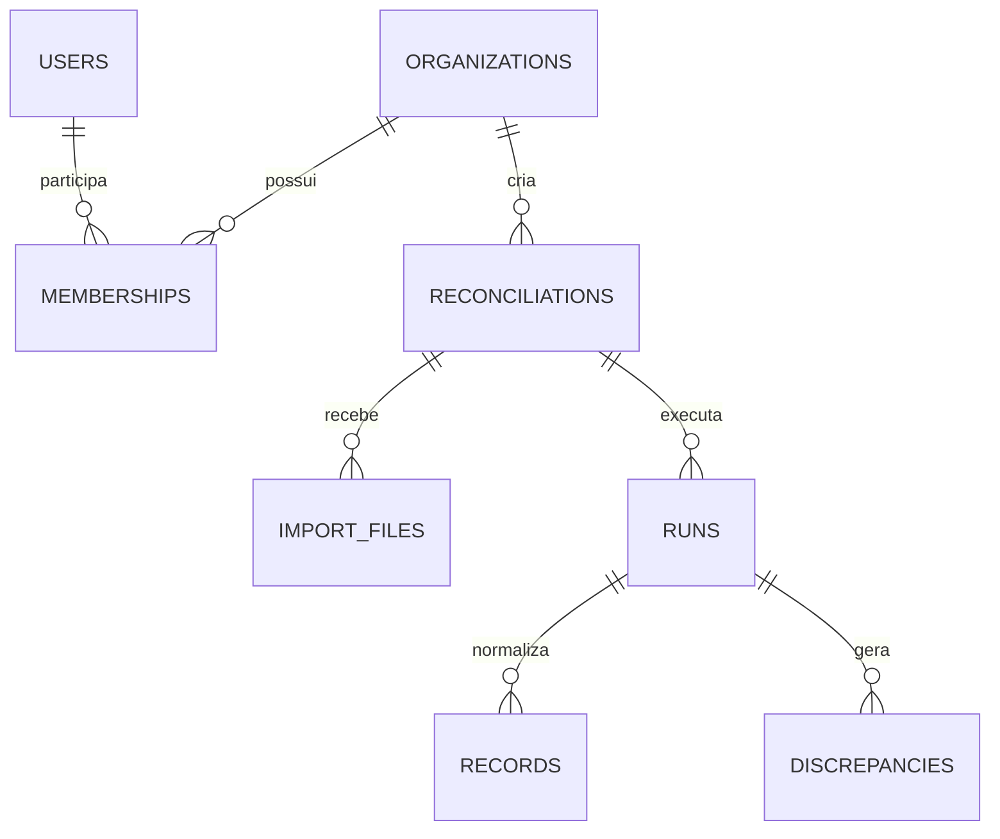

# Modelo de dados

## Tabelas

- `organizations`: id, nome e criação.
- `users`: id, nome, e-mail único, hash da senha e status.
- `memberships`: organização, usuário e perfil; chave única composta.
- `reconciliations`: organização, nome, competência, status e criador.
- `import_files`: conciliação, fonte A/B, nome original, chave de armazenamento, SHA-256, tamanho e status.
- `runs`: tentativa, status, contadores, início, fim e código de erro.
- `records`: fonte, identificador externo, data, `amount_cents`, linha original em JSONB e número da linha.
- `discrepancies`: tipo, registros relacionados, diferença em centavos, status e observação.
- `jobs`: tipo, payload, status, tentativas, disponibilidade, bloqueio e último erro.
- `audit_logs`: ator, ação, recurso, metadados e data.

## Restrições e índices

- todas as tabelas de negócio possuem `organization_id`;
- índice principal de registros: `(organization_id, run_id, source, external_id)`;
- apenas uma versão ativa de arquivo por conciliação e fonte;
- datas e horários em UTC;
- dinheiro em centavos, nunca `float`;
- UUIDs como chaves públicas;
- `raw_row` segue política de retenção e não aparece em logs.
